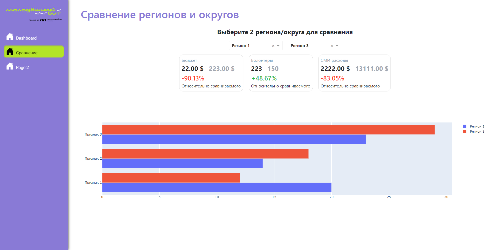

[![Contributors][contributors-shield]][contributors-url]
[![Forks][forks-shield]][forks-url]
[![Stargazers][stars-shield]][stars-url]
[![Issues][issues-shield]][issues-url]

<!-- PROJECT LOGO -->
<br />
<div align="center">
  <a href="https://github.com/dmitrykulakovfrontend/YouthBitDashboard">
    
  </a>

  <h2 align="center"><strong>Молодёжный бит «Дашборд»</strong></h3>

  <p align="center">
    <a href="https://youthbitdashboard.onrender.com/compare"><strong>Демо »</strong></a>
  </p>
</div>

### **Использованные Технологии**

- 
- 
- 
- 
- 
- 
<p align="right">(<a href="#readme-top">back to top</a>)</p>

### Требования к установке

- [Python: 3.8+](https://www.python.org/)

- [pip: 20+](https://pypi.org/project/pip/)

- [git](https://git-scm.com/)

### Установка

1. Загрузите локальную версию репозитория
   ```sh
   git clone https://github.com/dmitrykulakovfrontend/YouthBitDashboard.git
   ```
2. Перейдите в загруженный репозиторий
   ```sh
   cd YouthBitDashboard
   ```
3. Запустите эту команду для создания виртуального пространства и убедитесь что у вас появилась папка .venv:
   ```sh
   python -m venv .venv # или py -m venv .venv
   ```
4. Установите все необходимые пакеты:
   ```sh
   .venv\Scripts\pip install -r requirements.txt
   ```
5. Запустите app.py:
   ```sh
   .venv\Scripts\python src\app.py
   ```
6. Сервер запущен на http://127.0.0.1:8050/

[contributors-shield]: https://img.shields.io/github/contributors/dmitrykulakovfrontend/YouthBitDashboard.svg?style=for-the-badge
[contributors-url]: https://github.com/dmitrykulakovfrontend/YouthBitDashboard/graphs/contributors
[forks-shield]: https://img.shields.io/github/forks/dmitrykulakovfrontend/YouthBitDashboard.svg?style=for-the-badge
[forks-url]: https://github.com/dmitrykulakovfrontend/YouthBitDashboard/network/members
[stars-shield]: https://img.shields.io/github/stars/dmitrykulakovfrontend/YouthBitDashboard.svg?style=for-the-badge
[stars-url]: https://github.com/dmitrykulakovfrontend/YouthBitDashboard/stargazers
[issues-shield]: https://img.shields.io/github/issues/dmitrykulakovfrontend/YouthBitDashboard.svg?style=for-the-badge
[issues-url]: https://github.com/dmitrykulakovfrontend/YouthBitDashboard/issues
